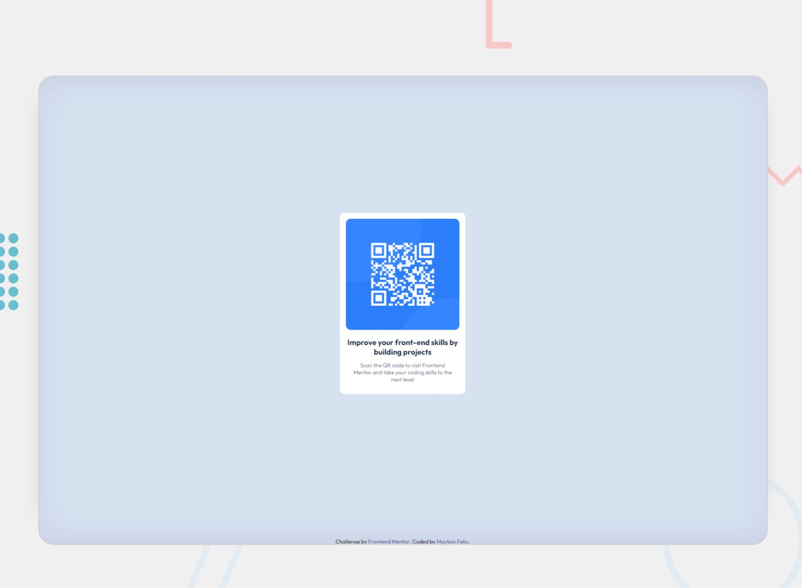

# Frontend Mentor - QR code component solution

This is a solution to the [QR code component challenge on Frontend Mentor](https://www.frontendmentor.io/challenges/qr-code-component-iux_sIO_H). Frontend Mentor challenges help you improve your coding skills by building realistic projects. 

## Table of contents

- [Overview](#overview)
  - [Screenshot](#screenshot)
  - [Links](#links)
- [My process](#my-process)
  - [Built with](#built-with)
  - [What I learned](#what-i-learned)
- [Author](#author)

**Note: Delete this note and update the table of contents based on what sections you keep.**

## Overview

### Screenshot

<p>Design preview for the QR code component coding challenge</p>


### Links

- Live Site URL: [Can See Here!!!](https://qr-code-component-one-tawny.vercel.app/)

## My process

### Built with

- Semantic HTML5 markup
- CSS custom properties
- Flexbox
- CSS Grid

### What I learned

As I'm studying responsiveness at university, I did a study on this project and learned very well about this function of @media.

```css
@media (max-width: 375px) { 
  main { 
    color: red;
  }}
```

## Author

- Website - [Portifolio](https://maykon.vercel.app/)
- Frontend Mentor - [@yourusername](https://www.frontendmentor.io/profile/yourusername)
- Linkedin - [Maykon Felix](https://www.linkedin.com/in/maykonfelixwebdeveloper/)
